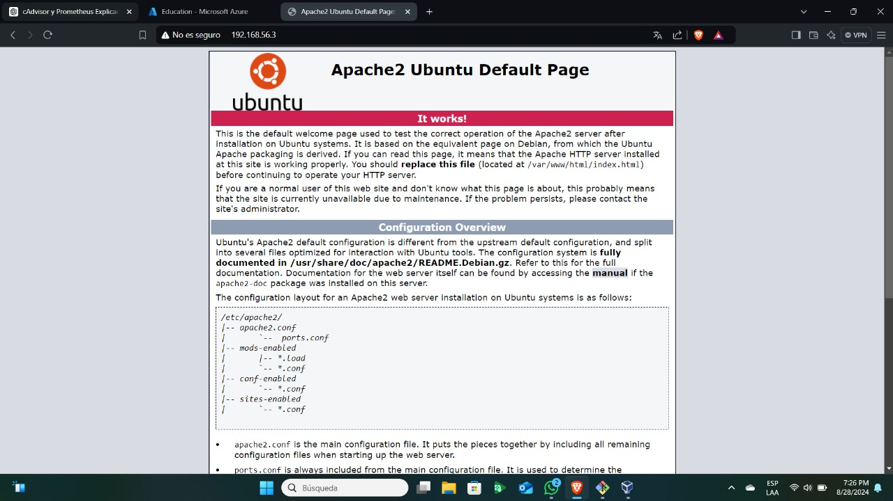
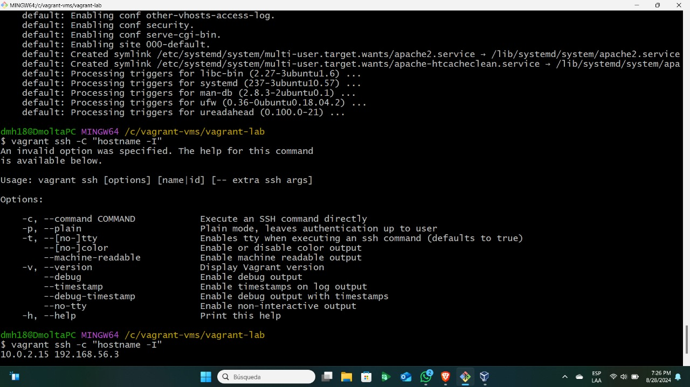
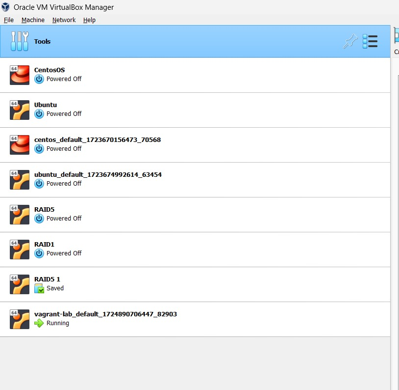

# Proyecto de Configuración de Servidor Web Apache con Vagrant

Este proyecto está diseñado para crear y configurar automáticamente una máquina virtual que ejecuta un servidor web Apache, utilizando Vagrant y VirtualBox. La máquina virtual está basada en Ubuntu 18.04, y se configura automáticamente para instalar y ejecutar Apache, lo que permite servir páginas web directamente desde tu máquina local.

## Descripción del Vagrantfile

El `Vagrantfile` proporcionado incluye varios componentes clave que se describen a continuación:

### 1. Selección de la Caja Base

```
config.vm.box = "ubuntu/bionic64"
```

Aquí se especifica la caja base que se utilizará para crear la máquina virtual. Se ha elegido `ubuntu/bionic64`, que corresponde a Ubuntu 18.04 LTS. Esta versión de Ubuntu es conocida por su estabilidad y soporte a largo plazo, lo que la convierte en una opción confiable para servidores.

### 2. Configuración de la Red

```
config.vm.network "private_network", type: "dhcp"
```

Esta línea configura una red privada para la máquina virtual. Se utiliza `type: "dhcp"` para que la IP sea asignada automáticamente por DHCP, lo que permite que la máquina virtual sea accesible desde el host local a través de esta red privada.

Al principio tuve un error debido al DCHP pero simplemente lo arreglé eliminando una configuración existente en virtual box.
### 3. Provisión de Apache

```
config.vm.provision "shell", inline: <<-SHELL
  apt-get update
  apt-get install -y apache2
SHELL
```

Este bloque de código define un script de shell que se ejecuta automáticamente cuando la máquina virtual es creada. El script actualiza la lista de paquetes e instala Apache2. Este paso asegura que Apache esté instalado y listo para servir páginas web desde el directorio configurado.

### 4. Carpeta Sincronizada

```
config.vm.synced_folder ".", "/var/www/html"
```

Aquí se configura una carpeta sincronizada entre el host y la máquina virtual. La carpeta actual (`"."`) en el host se sincroniza con `/var/www/html` en la máquina virtual, que es el directorio predeterminado donde Apache busca archivos para servir. Esto permite desarrollar y editar archivos localmente, con los cambios reflejados instantáneamente en el servidor.

### 5. Configuración de la Máquina Virtual

```
config.vm.provider "virtualbox" do |vb|
  vb.memory = "1024"
end
```

Este bloque configura la máquina virtual para que use 1024 MB de memoria RAM. Esta cantidad de memoria es suficiente para ejecutar un servidor web ligero y otros servicios básicos.

## Evidencia de Apache Corriendo

A continuación, se presentan imágenes que muestran el servidor Apache corriendo correctamente en la máquina virtual configurada.






